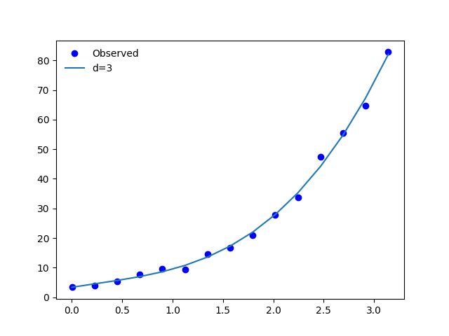
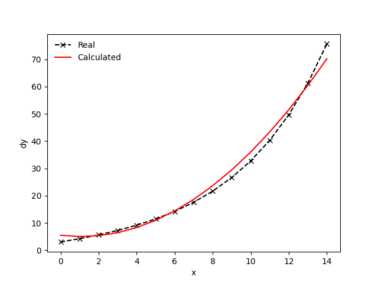
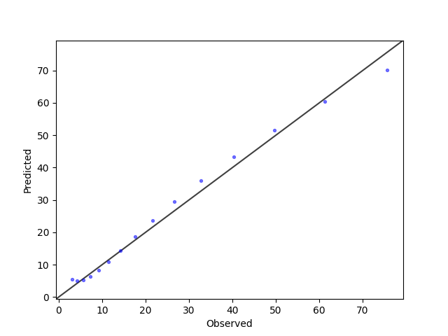
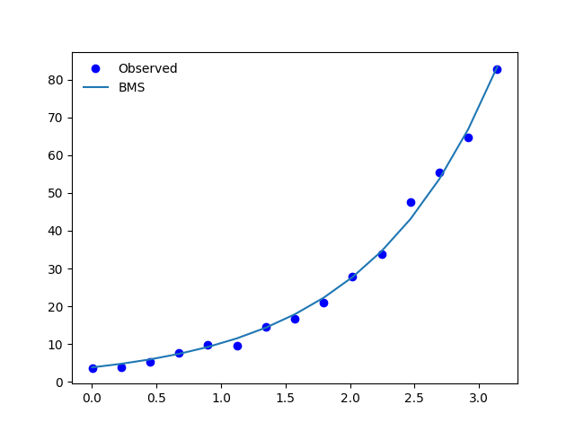
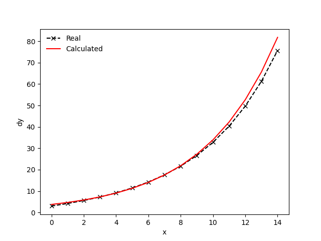
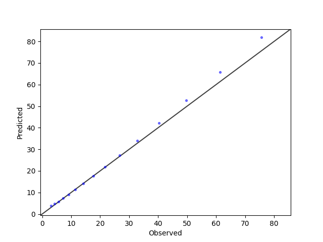
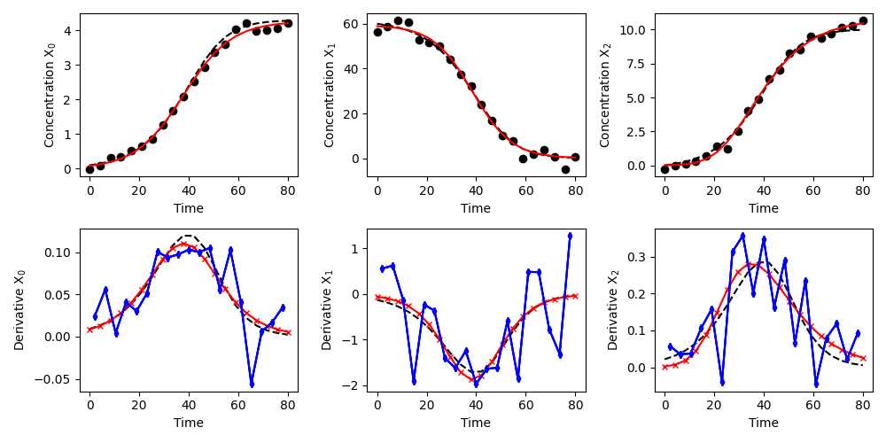

udiff
=====
This package specifically targets applications in kinetic model development for chemical and biochemical reactions. Examples are given in [Forster et al. (2024)](#references).

The situation considered is the following: The modeler has access to noisy concentration data (i.e., from a batch reactor). A model structure for the dynamics is chosen by the modeler (i.e., $\frac{dy}{dt}=k\cdot y$). The modeler then needs to estimate the parameters (i.e., the rate constant $k$ in this example). 

One possible way to estimate the parameters in such a situation is to calculate the derivatives $\frac{dy}{dt}$ from the noisy data. With this, the equation of the model can be solved for the parameters. However, this is not trivial in case data is scarce and if the data is noisy.

The performance of the model heavily depends on the accuracy of the derivative calculation in the first step. This package includes a collection of tools for simplifying this process. It includes a smoothing and a differentiation module. Both of them are discussed below.

- [Installation](#installation) 💻
- [Included tools](#included-tools) 🧰
- [Examples](#examples) ⚗️
  * [Exponential function - Polynomial regression approach](#polynomial-fit-to-exponential-function)
  * [Exponential function - Symbolic regression approach](#bms-fit-to-exponential)
  * [Batch bioprocess](#bioprocess)
- [References](#references) 📚


Installation
============
If you are a git user, try to install the package using the following command:
```
pip install git+https://github.com/forstertim/udiff.git
```

Alternatively, you can clone the repository and install it. To easily add your own case studies, install in developer mode (`-e` in the pip install command):
```
git clone https://github.com/forstertim/udiff.git
cd simulator
pip install -e .
```

If you do not use git, above, click the button `Code` and select Download ZIP. Unzip the files and store the folder in a place of your choice. Open a terminal inside that folder (you should see the `setup.py` file). Run the following command in the terminal:
```
pip install -e .
```

By using `pip list`, you should see the package installed in your environment (together with the path to the corresponding folder if you installed in developer mode).

Included tools
==============

## Smoothing
As mentioned above, the presence of noise can make the calculation of derivatives very hard. This smoothing module includes functions that first create a smooth version of the noisy data. Currently, the concept is to fit an analytical function through the data. The reason for this is that this function can then be derived analytically.

The following methods are available:

* **Polyfit**: A polynomial is fit through the data points. The user can indicate the maximum degree of the polynomial. The algorithm searches for the best Bayesian Information Criterion (BIC) and returns the coefficients of the most appropriate polynomial that can be derived analytically. This package includes an improved approach applied in a work for kinetic model development for biochemical reactions [Forster et al. (2023)](#references) and [Forster et al. (2024)](#references). 

* **Symbolic regression fit**: Symbolic regression searches for an algebraic function that fits the data in an appropriate manner. Currently, the Bayesian Machine Scientist (BMS) [Guimerà et al. (2020)](#references) is implemented in this package. The user can define allowed unary/binary operators (i.e., +, -, div, mul, etc.) and a number of iteration steps (Markov-chain Monte Carlo steps, MCMC). The function returns a sympy expression that can subsequently be derived analytically.

* **Fit of function library**: This module is currently under development. The user can use a library of functions. The algorithm will fit all of those functions and returns the most appropriate one based on a specific fitting metric (currently, the root mean squared error, RMSE, is chosen as such). The function returns a sympy expression that can subsequently be derived analytically.

## Differentiation
Differentiation via the sympy package (after using a function library or symbolic regression fit) or via polynomial differentiation (using a polyfit).

In addition, numerical differentiation techniques can be used. If discrete data is handed to the differentiator object, no smoothing is performed and the data is directly numerically differentiated. Currently, the following options are implemented:

* **Forward finite differences (FD)**: The classical forward finite difference method is applied.

Examples
========

## Polynomial fit to exponential function
The example code is stored in `examples/main_polynomial_fit.py`.

Import some required packages and get the smoothing/differentiating modules of udiff:
```python
import numpy as np
import random 
random.seed(0)
import matplotlib.pyplot as plt
from udiff.smooth import smooth_polynomial
from udiff.differentiate import differentiator
```

Now, we can generate some data and add some noise to it:
```python
X = np.linspace(1e-3, np.pi, nsamples)
Y_real = X**2 + 3*np.exp(X)
np.random.seed(0)
noise = np.random.normal(0,0.1,len(Y_real))
Y = Y_real * (1+noise)
dY = 2*X + 3*np.exp(X)
```

Then, we can create an instance of the polynomial smoothing object. The x- and y- data have to be handed over.
```python
obj = smooth_polynomial(x=X, y=Y)
```

Subsequently, the polynomials are fit. We choose a maximum degree of d=8. This means, polynomials with degrees 1, 2, ..., 8 are fit and the best fit is returned according to the lowest BIC. The best fit can be plotted.
```python
obj.fit_polynomial(maxdeg=8)
obj.plot_fit()
```



*Fig 1. Example of a polynomial fit through noisy data.*

Finally, we perform the analytical differentiation of that found polynomial and compare the accuracy (the R2 value is anyway calculated in the 'compare_calculated_and_real_derivatives' function) by plotting the real and calculated derivatives and observed-vs-predicted plots:
```python
diffobj = differentiator(obj)
diffobj.differentiate()
diffobj.compare_calculated_and_real_derivatives(calc_diff=diffobj.y_diff,
                                                real_diff=dY,
                                                type_of_comp=['OVP', 'profile'])
```


*Fig 2. Calculated derivatives with underlying ground truth.*



*Fig 3. Observed-vs-predicted (OVP) plot of the derivatives.*

The plots are visualized with `plt.show()`.

## BMS fit to exponential
The example code is stored in `examples/main_bms_fit.py`.

Similar to the example above, one can create an instance of the bms smoothing object. The x- and y- data have to be handed over.
```python
obj = smooth_bms(x=X, y=Y)
```

Subsequently, a BMS model is fit. Several stopping criteria are available:
* **nsteps**: The number of MCMC steps. As soon as the indicated value (integer) is reached, the fit stops and returns the best fit identified up to that point.
* **maxtime**: The maximum time in seconds. If the indicated value (integer) is reached, the fit stops and returns the best fit identified up to that point.
* **minr2**: The minimum value of the coefficient of determination (R2). If the indicated value (float) is reached, the fit stops and returns the best fit identified up to that point.
Additionally, the name of the pickle file can be given if the model should be saved.

```python
obj.fit_bms(nsteps=150, maxtime=100, minr2=0.98, savename='bms_series1')
obj.plot_fit()
```



*Fig 4. Example of a BMS fit through noisy data.*

Finally, we perform the analytical differentiation of that found polynomial and compare the accuracy (the R2 value is anyway calculated in the 'compare_calculated_and_real_derivatives' function) by plotting the real and calculated derivatives and observed-vs-predicted plots:
```python
diffobj = differentiator(obj)
diffobj.differentiate()
diffobj.compare_calculated_and_real_derivatives(calc_diff=diffobj.y_diff,
                                                real_diff=dY,
                                                type_of_comp=['OVP', 'profile'])
```


*Fig 5. Calculated derivatives with underlying ground truth.*



*Fig 6. Observed-vs-predicted (OVP) plot of the derivatives.*

The plots are again visualized with `plt.show()`.

## Bioprocess
The example code is stored in `examples/main_bms_fit_bioprocess.py`.

After creating some data by solving an ODE model and adding some noise, each species of the bioprocess can be analysed individually. Here, the x- and y- data are the time vector and the concentration profile of each species.
The underlying ground truth of the derivatives are also calculated:
```python
data = datagen() # <- Check class in examples/main_bms_fit_bioprocess.py
data.solve_ODE_model()
data.addnoise_per_species()
data.evaluate_true_derivatives()
```

Subsequently, a BMS model is fit to each concentration profile individually, using the same stopping criteria as above:
```python
# Create empty arrray for fitted profiles
data.y_smooth = np.zeros(data.y.shape)
data.y_diff = np.zeros(data.y.shape)
data.x_diff_fd = np.zeros((data.y.shape[0]-1, data.y.shape[1]))
data.y_diff_fd= np.zeros((data.y.shape[0]-1, data.y.shape[1]))

# Fit profiles 
for spec_id in range(data.y.shape[1]):
    # Each species individually
    X = data.tspan
    Y = data.y_noisy[:, spec_id]
    # Create new object
    obj = smooth_bms(x=X, y=Y, scaling=False)
    # Fit profiles
    obj.fit_bms(nsteps=1e4, maxtime=3.6e3, minr2=0.999, show_update=True, update_every_n_seconds=200) 
    # Store data
    data.y_smooth[:, spec_id] = obj.y_smooth
    # Differentiate algebraic equation
    diffobj = differentiator(obj)
    diffobj.differentiate()
    # Store data
    data.y_diff[:, spec_id] = diffobj.y_diff
    # Calculate finite differences for comparison
    y_der_FD = []
    x_der_FD = []
    dt = (data.tspan[1] - data.tspan[0])/2
    for t_ in range(len(data.tspan)-1):
        x_der_FD.append(data.tspan[t_] + dt)
        y_der_FD.append((Y[t_+1] - Y[t_])/(data.tspan[t_+1] - data.tspan[t_]))
    data.x_diff_fd[:, spec_id] = np.array(x_der_FD)
    data.y_diff_fd[:, spec_id] = np.array(y_der_FD)
```
As a comparison to the calculated derivatives by the symbolic regression approach, the forward finite difference method is applied. The results are compared in the following plots.



*Fig 7. Example of a BMS fit through noisy bioprocess data. The top row shows concentration profiles (ground truth (dashed black line), noisy observations (black circles), BMS fit (red solid line)). The bottom row shows the derivatives (ground truth (dashed black line), forward finite differences (blue line with diamond), BMS calculations (red line with crosses)).*


Citation
========
If you use this package in your research, please cite the following publication: 

> **Forster et al.**, Machine learning uncovers analytical kinetic models of bioprocesses. **2024**. *Chemical Engineering Science*. [URL](https://www.sciencedirect.com/science/article/pii/S0009250924009060).

Additional References
=====================

> **Forster et al.**, Modeling of bioprocesses via MINLP-based symbolic regression of S-system formalisms. **2023**. *Computers & Chemical Engineering*. [URL](https://www.sciencedirect.com/science/article/pii/S0098135422004410)

> **Guimerà et al.**, A Bayesian machine scientist to aid in the solution of challenging scientific problems. **2020**. *Sci. Adv.*. [URL](https://www.science.org/doi/10.1126/sciadv.aav6971)